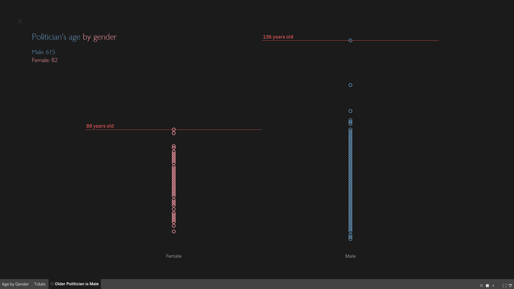

# Older Politician is Male
A task analysis to prove the hypothesis: Older Politician is Male. 

## Description
* Define a hypothesis (select 2 or more columns of the data and write up a hypothesis). Visualize data using scatterplot. 
* *brazil.json* is the data set that you are supposed to use
* Even though there are no explicit numeric values - you could derive it from the data.

> e.g. from birthdate you can derive the age of the politician

You could plot age vs gender to see if there is correlation between the gender of the politician and their age. The hypothesis older politician is male.

## Features
- I've derived the ages of politicians and plotted a scatter plot but gone ahead to better the visualization using Tableau.
- It's much interactive and answers the question 👌🏽

🔥 Interact with the <a href="https://public.tableau.com/app/profile/briank/viz/PoliticianAge/OlderPoliticianisMale" target="_blank">Dashboard.</a>

🔥 Tip: View in full screen (The rectangular button in the bottom right corner)

## Requirements
> - Pandas
> - Matplotlib
> - Datetime

## License
MIT License. Copyright (c) 2022 Brian Kiume